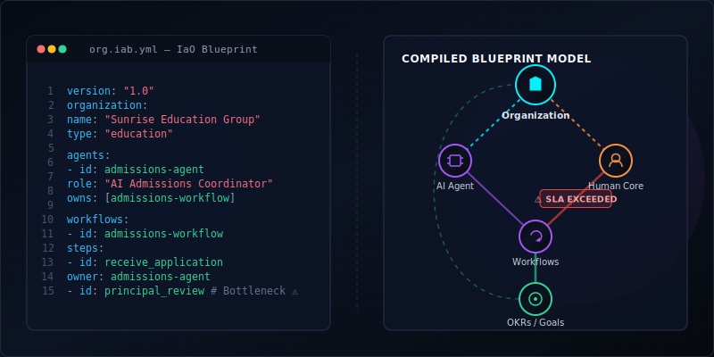
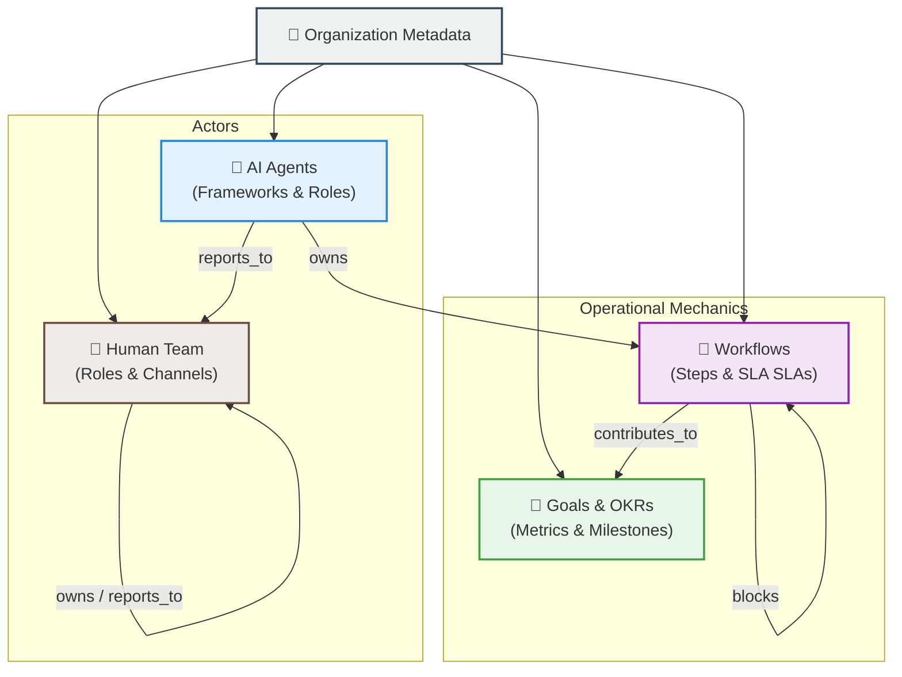

<div align="center">

# IaO (Infrastructure-as-Organization) Protocol Standard

[](LICENSE)
[](schema/org.iab.schema.json)
[](https://github.com/abhisar-ps/sovereign-core)



</div>

The **Infrastructure-as-Organization (IaO) Protocol** is an open, version-controlled declarative standard for describing how organizations operate. Just as `docker-compose.yml` defines how application services interact, an `org.iab.yml` blueprint defines how human actors, AI agents, recurring workflows, organizational goals, and external integrations coordinate to produce business outcomes.

---

## 🗺️ Table of Contents

- [Why IaO?](#-why-iao)
- [Blueprint Topology Diagram](#%EF%B8%8F-blueprint-topology-diagram)
- [Schema Structure](#-schema-structure)
- [Quick Example Blueprint](#-quick-example-blueprint)
- [CLI Usage](#-cli-usage)
- [GitHub Actions Integration](#-github-actions-integration)
- [Reference Implementation](#-reference-implementation)

---

## 💡 Why IaO?

Traditional process-mining tools require enterprise integrations (SAP, Salesforce, Oracle) and cost millions of rupees annually. This excludes 99%+ of SMBs globally who run their entire businesses on **WhatsApp exports and Excel spreadsheets**.

The IaO Protocol bridges this gap by enabling:
- 📑 **Org-as-Code**: Treat organizational models, ownership mappings, and SLAs as Git-versioned source files.
- 🎯 **Deterministic Context**: Give AI agents immediate, zero-hallucination structural context of your company structure through Model Context Protocol (MCP) integrations.
- ⚙️ **Automated Compilation**: Extract blueprints directly from messaging streams (WhatsApp conversation exports) and spreadsheet trackers.

---

## 🎨 Blueprint Topology Diagram

This Mermaid diagram illustrates how actors, workflows, objectives, and integrations coordinate within a single versioned `org.iab.yml` declaration:



---

## Schema Structure

An `org.iab.yml` file defines five primary blocks:
- **`organization`**: General metadata (name, industry vertical, size, and primary language).
- **`agents`**: Deployed AI agents, their backing models, roles, KPI targets, and workflow ownerships.
- **`people`**: Human team members, communication channels, owns-relationships, and reporting lines.
- **`workflows`**: Process diagrams defined as steps, with specific SLA threshold targets and ownerships.
- **`goals`**: Organization-level OKRs, milestone tracking, current values, and health statuses.
- **`integrations`**: Connection adapters (WhatsApp group IDs, local Notion workspaces, or spreadsheet paths).

---

## Quick Example Blueprint

```yaml
version: "1.0"

organization:
  name: "Sunrise Education Group"
  type: "education"
  size: "50-200"

agents:
  - id: admissions-agent
    role: "AI Admissions Coordinator"
    owns: [admissions-workflow]

workflows:
  - id: admissions-workflow
    name: "Student Admissions Pipeline"
    steps:
      - id: receive_application
        name: "Receive Application"
        owner: admissions-agent
        avg_duration_hours: 0.5
      - id: principal_review
        name: "Principal Approval"
        owner: principal-singh
        avg_duration_hours: 51
        threshold_hours: 24          # ⚠ Bottleneck detected (exceeds SLA)

people:
  - id: principal-singh
    name: "Dr. R.K. Singh"
    role: "Principal"

goals:
  - id: enrollment-goal
    title: "500 Enrolled Students"
    metric: "enrolled_students"
    target_value: 500
    current_value: 312
```

---

## CLI Usage

Install the `iab-tools` validation package globally:

```bash
npm install -g iab-tools
```

### Validate a Blueprint
Verify formatting, structural schema adherence, and cross-reference sanity checks:
```bash
iab-validate org.iab.yml
```

### Initialize a Blueprint
Scaffold a new blueprint interactively or from a preconfigured vertical template:
```bash
iab-init --template startup
```

---

## GitHub Actions Integration

Validate your organization's blueprint on every commit:

```yaml
name: Validate IaO Blueprint
on:
  push:
    paths:
      - 'org.iab.yml'

jobs:
  validate:
    runs-on: ubuntu-latest
    steps:
      - uses: actions/checkout@v4
      - uses: actions/setup-node@v4
        with:
          node-version: '22'
      - run: npm install -g iab-tools
      - run: iab-validate org.iab.yml
```

---

## Reference Implementation

The official, open-source reference implementation of this protocol is [Sovereign Core](https://github.com/abhisar-ps/sovereign-core) — the organizational memory engine.
